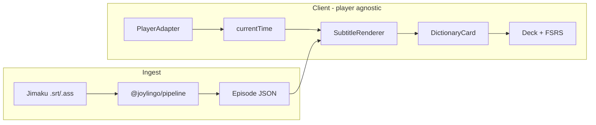
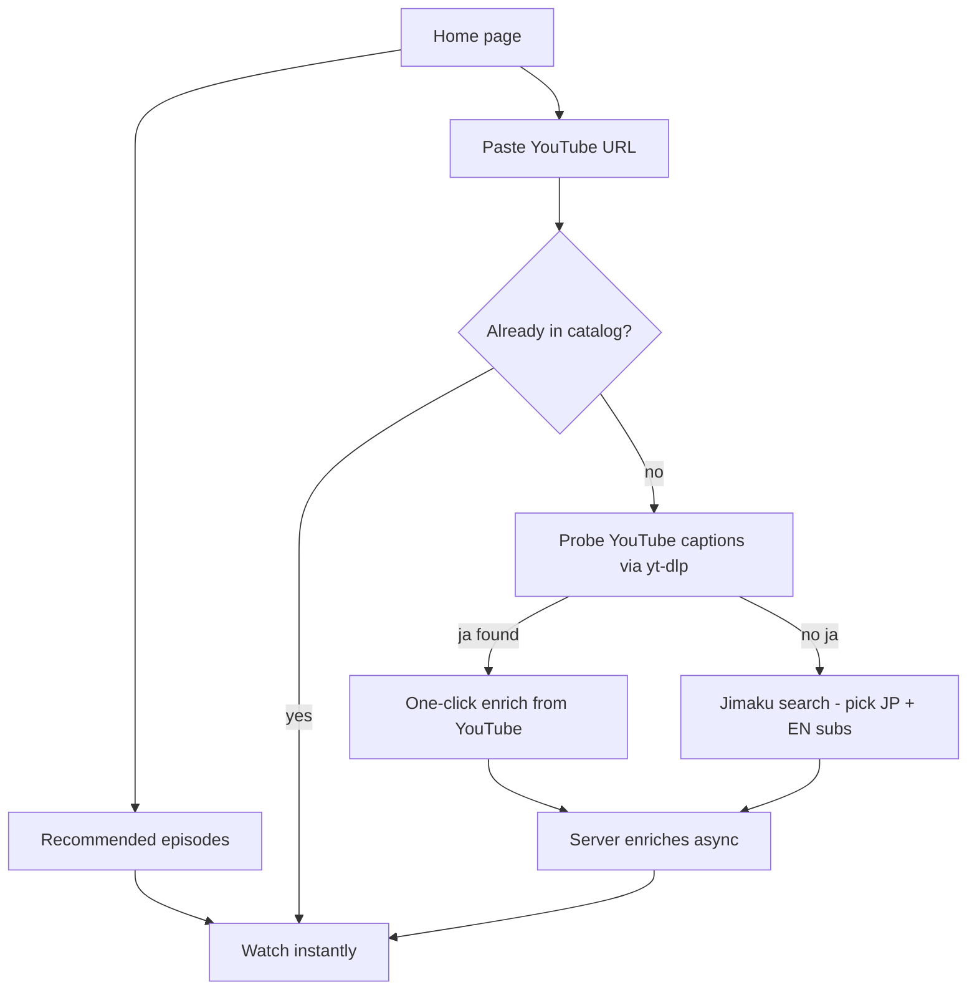
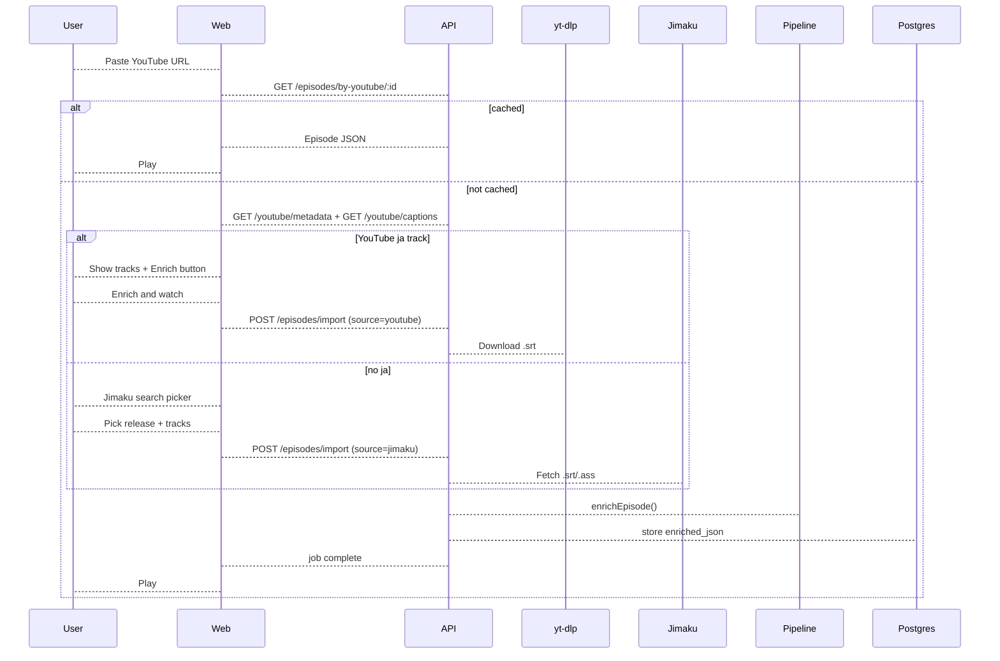
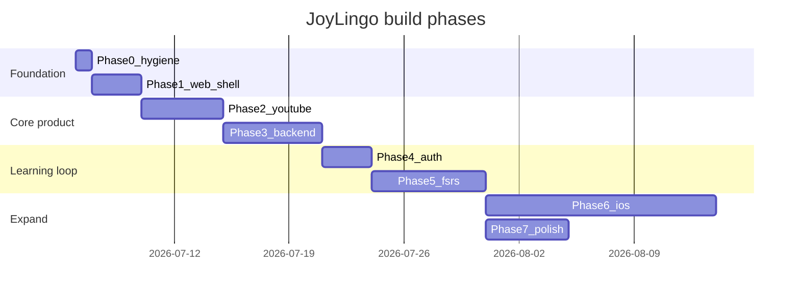

# JoyLingo — Full App Build Guide

A phased build guide from the current pipeline-only monorepo to the full JoyLingo product: web immersion player with YouTube sync, backend episode serving, Postgres deck + FSRS, then iOS via Expo. **Web-first.**

## Build checklist

- [x] **Phase 0** — Repo hygiene (`build`/`pretest` scripts)
- [x] **Phase 1** — Web app shell (Vite + React, port prototype)
- [x] **Phase 2** — YouTube IFrame player (adapter + manifest + routing; real episode bound — `morning-routine`)
- [x] **Phase 3** — Backend API + Postgres + user home (paste URL, Jimaku, recommendations) — built on PGlite (embedded Postgres); Jimaku picker needs `JIMAKU_API_KEY`; end-to-end import untested until a key is set
- [ ] **Phase 4** — Auth + user accounts
- [ ] **Phase 5** — Deck persistence + FSRS
- [ ] **Phase 6** — iOS via Expo
- [ ] **Phase 7** — Production polish

---

## Where you are now

| Done | Not built yet |
|------|---------------|
| [`packages/pipeline`](../packages/pipeline) — enrich `.srt`/`.ass` → `Episode` JSON | Web app (`npm run dev`) |
| [`packages/shared`](../packages/shared/src/index.ts) — `Episode`/`Line`/`Token` contract | YouTube IFrame player |
| [`immersion_player_prototype.jsx`](../immersion_player_prototype.jsx) — UI spec (mock clock, deck in memory) | Backend API |
| Your `episode.json` from the sample run | Postgres + FSRS |
| | iOS (Expo) |

**Core architectural rule (already designed):** the client only needs `currentTime` + pre-enriched `Episode` JSON. It never tokenizes Japanese. Everything below the player is player-agnostic.



---

## Target monorepo layout

```
JoyLingo/
├── packages/
│   ├── shared/          # exists — Episode types
│   ├── pipeline/        # exists — enrichment CLI + lib
│   ├── player-core/     # NEW — shared player-agnostic logic (hooks, deck types)
│   ├── api/             # NEW — Express/Fastify + Postgres
│   └── web/             # NEW — Vite + React app
├── apps/
│   └── mobile/          # LATER — Expo (Phase 6)
└── immersion_player_prototype.jsx  # retire after port
```

Keep **player-agnostic UI logic** in `packages/player-core` so web and iOS share subtitle sync, deck state, and review flow without duplicating the prototype.

---

## Phase 0 — Repo hygiene (1 day)

Fix the footgun you already hit: tests fail on fresh clone because `@joylingo/shared` points at `dist/`.

- Add root scripts:
  - `"build": "tsc -b"`
  - `"pretest": "npm run build"` (or Vitest alias to `packages/shared/src`)
- Update [README.md](../README.md) quick start: `npm run build` before `npm test`

**Exit criteria:** `npm install && npm test` passes on a clean machine.

---

## Phase 1 — Web app shell (2–3 days)

**Goal:** `npm run dev` opens a browser with the immersion player UI loading real `episode.json`.

### 1a. Scaffold `packages/web`

- Vite + React + TypeScript
- Workspace dep on `@joylingo/shared` and (later) `@joylingo/player-core`
- Root script: `"dev": "npm run dev -w @joylingo/web"`

### 1b. Port the prototype

Split [`immersion_player_prototype.jsx`](../immersion_player_prototype.jsx) into:

| File | Responsibility |
|------|----------------|
| `ImmersionPlayer.tsx` | layout, state wiring |
| `SubtitleLine.tsx` | ruby/furigana, tap targets, learning/known highlights |
| `DictionaryCard.tsx` | gloss, context, add-to-deck |
| `Transcript.tsx` | line list, seek-on-tap |
| `DeckPanel.tsx` | mined words grid |
| `ReviewModal.tsx` | simplified SRS (in-memory for now) |
| `immersion-player.css` | extract inline `css` string |

Replace hardcoded `SAMPLE_EPISODE` with:

```ts
import type { Episode } from "@joylingo/shared";
import episode from "../public/episodes/eki-de.json"; // copy your enriched JSON here
```

Use `isWord()` from `@joylingo/shared` instead of `tok.punct` checks.

### 1c. Mock player adapter (temporary)

```ts
// packages/player-core/src/adapters/MockPlayerAdapter.ts
export interface PlayerAdapter {
  getCurrentTime(): number;
  seek(seconds: number): void;
  play(): void;
  pause(): void;
  getDuration(): number;
  onTimeUpdate(cb: (t: number) => void): () => void;
}
```

Wire the prototype's `requestAnimationFrame` clock through this interface so swapping to YouTube later is one file change.

**Exit criteria:** Play/pause, subtitle sync, tap word → dictionary card, add to deck, transcript seek — all working with your real `episode.json`.

---

## Phase 2 — YouTube player (3–5 days)

**Goal:** Replace mock player with a real YouTube video; subtitles stay in sync.

### 2a. YouTube IFrame API adapter

Create `packages/player-core/src/adapters/YouTubePlayerAdapter.ts`:

- Load IFrame API script in `packages/web/index.html`
- `new YT.Player("yt-mount", { videoId, events: { onReady, onStateChange } })`
- Poll `player.getCurrentTime()` at ~250ms (as noted in prototype comments)
- Map play/pause/seek to IFrame API methods

### 2b. Episode ↔ video binding

Add optional fields to episode metadata or a separate `EpisodeSource` config:

```ts
interface EpisodeSource {
  episodeId: string;
  youtubeVideoId: string;
  subtitleOffset?: number; // seconds, if subs drift from video
}
```

**Subtitle timing:** pipeline README notes drift is fixed upstream (ffsubsync/alass) before enrichment. Expose a manual `subtitleOffset` slider in dev tools for tuning.

### 2c. URL routing

```
/watch/:episodeId?  →  loads episode JSON + YouTube videoId
```

Start with a static manifest (`episodes/index.json`) listing available episodes. Backend catalog comes in Phase 3.

**Exit criteria:** Watch a Muse Asia (or any legit) YouTube upload; interactive subtitles track the real video clock.

---

## Phase 3 — Backend API + user home (1–2 weeks)

**Goal:** No more editing `index.json` or running the CLI. Users open the site, pick a recommendation or paste a YouTube link, attach subtitles (YouTube captions first, Jimaku fallback), and watch.

### Why it feels dev-heavy today

The web app reads a **static manifest** ([`packages/web/public/episodes/index.json`](../packages/web/public/episodes/index.json)). Every new show needs:

1. CLI enrich → drop JSON in `public/episodes/`
2. Hand-edit manifest with `youtubeVideoId`

That is an **authoring** workflow, not a **learner** workflow. Phase 3 moves episodes into Postgres and replaces the catalog page with a real home screen.

### 3a. Target home UX



**Recommended** — curated rows, zero setup:

- "Start here" (駅で sample, short clips)
- "Popular on YouTube" (Muse Asia / legal uploads you pre-enrich once)
- "Recently added" / "Community favorites" (later)

One tap → `/watch/:id`. Same as Language Reactor's browse, but JoyLingo-owned catalog.

**Paste YouTube URL** — power-user path:

1. User pastes `https://youtube.com/watch?v=…`
2. Client extracts `videoId`, calls `GET /episodes/by-youtube/:videoId`
3. **Hit** → play immediately (subs already enriched)
4. **Miss** → [`AttachSubtitlesModal`](../packages/web/src/components/AttachSubtitlesModal.tsx) probes YouTube captions (`GET /youtube/captions` via yt-dlp); if Japanese tracks exist, one-click enrich. Otherwise → Jimaku attach flow (below). See [`docs/ytcc.md`](ytcc.md).

Support `/watch?v=VIDEO_ID` redirects so shared links work.

### 3b. Subtitle attach flow (YouTube-first, Jimaku fallback)

JoyLingo does **not** host or scrape video. For paste-URL misses, the server probes **YouTube's own caption tracks** via **yt-dlp** first ([`docs/ytcc.md`](ytcc.md)). If Japanese captions exist (creator-uploaded or auto-generated), the user enriches in one click. Jimaku is the fallback for anime fan subs when YouTube has no Japanese track.

**Step 1 — YouTube captions** (default)

- `GET /youtube/captions?videoId=` → list ja/en tracks + `recommended` picks (manual preferred over auto)
- `POST /episodes/import` with `source: "youtube"` → server downloads `.srt` via yt-dlp, runs `enrichEpisode`
- Requires `yt-dlp` on the API host (`PATH` or `YT_DLP_BIN`)

**Step 2 — YouTube metadata** (parallel with caption probe)

- `GET /youtube/metadata?videoId=` → title, channel (oEmbed)
- Pre-fill Jimaku search query when user opts into Jimaku fallback

**Step 3 — Jimaku search in-app** (fallback)

Research Jimaku's terms of service and whether a search API exists. Build in layers:

| Layer | UX | Effort |
|-------|-----|--------|
| **v1** | Deep-link to Jimaku search + "upload the .srt you downloaded" | Low |
| **v2** | Backend proxy: search Jimaku by title, show results in a picker | Medium |
| **v3** | Cache `youtube_video_id → jimaku_release_id` mappings; instant replay for popular pairs | Medium |

**v2 target UI:** After paste-URL miss → modal:

- Search box (pre-filled from YouTube title)
- Results: release name, episode #, JP / EN track badges
- User picks JP (+ optional EN) → backend downloads `.ass`/`.srt`, runs `enrichEpisode`, stores JSON

**Step 4 — Async enrichment**

Enrichment takes seconds. Show a progress state ("Tokenizing… attaching glosses…"), then redirect to player. Cache forever keyed by `(videoId, jimaku_release_id, sub_revision)`.

### 3c. Scaffold `packages/api`

- Fastify or Express + TypeScript
- Reuse `@joylingo/pipeline` as a library (`enrichEpisode`, `resolveGlossProvider` from [`packages/pipeline/src/index.ts`](../packages/pipeline/src/index.ts))
- Postgres via Drizzle or Prisma
- Job queue for enrich jobs (BullMQ / pg-boss, or inline for MVP)

### 3d. Core tables

```sql
episodes (
  id, title, title_en, duration,
  youtube_video_id UNIQUE,  -- lookup key for paste-URL
  subtitle_offset,
  enriched_json,
  jimaku_release_id,        -- provenance
  featured, featured_rank,   -- recommendations
  play_count,
  created_at
)
enrich_jobs (id, youtube_video_id, status, error, created_at)  -- async pipeline
subtitle_uploads (id, episode_id, lang, filename, raw_path, created_at)
```

### 3e. API endpoints

| Method | Path | Purpose |
|--------|------|---------|
| `GET` | `/episodes` | catalog; `?featured=true` for recommendations |
| `GET` | `/episodes/:id` | return `Episode` JSON |
| `GET` | `/episodes/by-youtube/:videoId` | paste-URL lookup (404 → attach flow) |
| `GET` | `/youtube/metadata?videoId=` | title/channel for search pre-fill |
| `GET` | `/youtube/captions?videoId=` | list YouTube caption tracks + recommended ja/en (yt-dlp) |
| `GET` | `/jimaku/search?q=` | proxy search results (v2) |
| `POST` | `/episodes/import` | `{ source: "youtube" \| "jimaku", … }` → queue enrich |
| `GET` | `/episodes/import/:jobId` | poll job status |
| `POST` | `/episodes/enrich` | fallback: raw `.srt` upload (v1 / power users) |
| `PATCH` | `/episodes/:id` | update `subtitle_offset` (persist sync slider) |

Enrichment flow:



### 3f. Web client changes

Replace static `Catalog` in [`packages/web/src/App.tsx`](../packages/web/src/App.tsx) with:

- **Home** — recommendation rows + prominent URL paste box
- **AttachSubtitlesModal** — YouTube caption probe + one-click enrich; Jimaku fallback
- **ImmersionPlayer** — fetch episode from API; persist `subtitleOffset` via `PATCH`

Keep static `public/episodes/` as dev fallback only (or delete once API ships).

**Exit criteria:**

- New user pastes a YouTube URL with creator captions → one-click enrich, watches in ~10s — no terminal, no `index.json` edit.
- New user pastes an anime URL with no YouTube ja subs → Jimaku picker → enrich → watch.
- Returning user opens a recommended episode in one click.

---

## Phase 4 — Auth + user accounts (2–3 days)

**Goal:** Each learner has their own deck.

- Auth: Clerk, Auth.js, or Supabase Auth (pick one; Clerk is fastest for solo dev)
- Tables: `users`, link `deck_cards.user_id`
- Protect deck endpoints; episodes can stay public-read

**Exit criteria:** Sign in on two browsers; decks are isolated.

---

## Phase 5 — Deck persistence + FSRS (5–7 days)

**Goal:** Replace in-memory `knowledge` map and simplified ReviewModal with real spaced repetition.

### 5a. Deck schema

```sql
deck_cards (
  id, user_id, dict, reading, gloss, surface,
  context_ja, context_en,
  episode_id, line_id, clip_start, clip_end,  -- link back to source clip
  fsrs_state JSONB,  -- stability, difficulty, due, reps, etc.
  status, created_at, updated_at
)
```

### 5b. FSRS integration

- Use [ts-fsrs](https://www.npmjs.com/package/ts-fsrs) (or `fsrs.js`)
- API:
  - `POST /deck` — mine a word (from dictionary card payload)
  - `GET /deck/due` — cards due for review
  - `POST /deck/:id/review` — grade (Again/Hard/Good/Easy) → update FSRS state

### 5c. Client updates

- `DeckPanel` reads from API; subtitle highlights reflect server-side knowledge
- `ReviewModal` uses real FSRS grades; optional "jump to clip" seeks player to `clip_start`
- Header chips: "N due" from `GET /deck/due` count

**Exit criteria:** Mine words while watching; close browser; return later; review queue persists and schedules correctly.

---

## Phase 6 — iOS via Expo (later, 2–3 weeks)

**Goal:** Same learning loop on iPhone.

- `apps/mobile` — Expo + React Native
- Share `@joylingo/shared` + `@joylingo/player-core` (subtitle sync, deck hooks, review logic)
- **Do not** share web-specific CSS; rebuild UI with RN components matching the prototype layout
- Player adapter: start with local `<Video>` (user's own files) or in-app browser for YouTube (limited; App Store rules apply — may need user-pasted video URL + WebView)
- Same API client as web

**Exit criteria:** Watch an episode, tap words, review deck on device.

---

## Phase 7 — Production polish

- **Caching:** CDN for `Episode` JSON; `ETag` from `meta.generatedAt`
- **Error states:** missing gloss (`gloss: null`), empty active line, YouTube API load failure
- **Performance:** memoize `activeLine` lookup (binary search on sorted `lines` by `start`)
- **Accessibility:** keyboard nav on transcript, `aria-label` on word tokens
- **Deploy:** Vercel/Netlify (web), Railway/Fly (API + Postgres)
- **Legal:** BYOM only — no video hosting/scraping; user supplies YouTube URLs

---

## Recommended build order (summary)



| Phase | You can ship after… |
|-------|---------------------|
| 1 | Demo-able web prototype with real enriched subs |
| 2 | **MVP** — watch real YouTube anime with interactive subs |
| 3 | Add new shows without code changes |
| 5 | **Full learning loop** — mine + FSRS review |
| 6 | iPhone app |

---

## Key files to leverage (don't rewrite)

- Types: [`packages/shared/src/index.ts`](../packages/shared/src/index.ts) — `Episode`, `WordToken`, `isWord()`
- Enrichment: [`packages/pipeline/src/enrich.ts`](../packages/pipeline/src/enrich.ts) — `enrichEpisode()`
- UI reference: [`immersion_player_prototype.jsx`](../immersion_player_prototype.jsx) — every component and interaction
- Sample data: [`packages/pipeline/episode.json`](../packages/pipeline/episode.json) — use as first web episode

---

## Dev workflow (steady state)

```bash
npm install
npm run build          # builds shared (+ pipeline if needed)
npm run dev            # web app
npm test

# enrich locally (until API exists)
npm run enrich -- packages/pipeline/samples/eki-de.ja.srt \
  --en packages/pipeline/samples/eki-de.en.srt --pretty --out packages/web/public/episodes/eki-de.json
```

---

## What to build first (actionable next step)

Start **Phase 1**:

1. Create `packages/web` (Vite + React + TS)
2. Create `packages/player-core` with `PlayerAdapter` + `usePlaybackClock` hook
3. Port prototype components; load `episode.json`
4. Add root `dev` and `pretest` scripts

That gives you `npm run dev` and a browser demo in one PR — the foundation for YouTube, backend, and FSRS.
