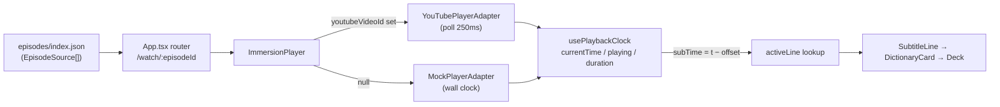

# Phase 2 — YouTube Player: Status, Verification & Remaining Work

> Companion to [BUILD_GUIDE.md](BUILD_GUIDE.md) Phase 2. Code is **built and type-checked**, but the
> exit criterion — *"watch a real YouTube upload with interactive subtitles tracking the video clock"* —
> has **not been verified end-to-end** with a real video yet. That verification is the current focus.

---

## 1. What is already built

### 1a. `YouTubePlayerAdapter`

[`packages/player-core/src/adapters/YouTubePlayerAdapter.ts`](../packages/player-core/src/adapters/YouTubePlayerAdapter.ts)

Implements the shared [`PlayerAdapter`](../packages/player-core/src/PlayerAdapter.ts) contract:

| Concern | Implementation |
|---|---|
| API loading | Script tag in [`packages/web/index.html`](../packages/web/index.html); adapter awaits `onYouTubeIframeAPIReady`, chaining any pre-existing callback |
| Time updates | No `timeupdate` event exists in the IFrame API → polls `player.getCurrentTime()` every **250 ms** (`POLL_MS`), only while playing |
| Play/pause state | `onStateChange` event; `PLAYING` starts the poll loop, anything else stops it |
| Seek | `seekTo(seconds, true)` + immediate optimistic time emit so the UI doesn't wait for the next poll |
| Duration | `getDuration()` — only valid after `onReady`; `usePlaybackClock` refreshes it on every time tick because YouTube reports `0` until ready |
| Teardown | `destroy()` clears the poll timer and destroys the player; a `destroyed` flag guards the async API-load race (StrictMode double-mount safe) |
| Typings | Minimal hand-declared `YTPlayer` / `YTNamespace` interfaces — no `@types/youtube` dependency |

### 1b. Episode ↔ video binding

[`packages/player-core/src/EpisodeSource.ts`](../packages/player-core/src/EpisodeSource.ts):

```ts
interface EpisodeSource {
  episodeId: string;
  title: string;
  titleEn: string | null;
  file: string;                    // URL of enriched Episode JSON
  youtubeVideoId: string | null;   // null → MockPlayerAdapter (demo clock)
  subtitleOffset?: number;         // seconds, default sync correction
}
```

Static manifest (backend catalog replaces this in Phase 3):
[`packages/web/public/episodes/index.json`](../packages/web/public/episodes/index.json)

Adapter selection is **one effect** in
[`ImmersionPlayer.tsx`](../packages/web/src/components/ImmersionPlayer.tsx):
`youtubeVideoId` set → `YouTubePlayerAdapter` mounts into `#yt-mount`; otherwise `MockPlayerAdapter(episode.duration)`. Nothing below the adapter knows which player is running.

### 1c. Subtitle offset (drift correction)

- `subTime = currentTime - offset` picks the active line; transcript seeks add the offset back (`line.start + offset`)
- Convention: **positive offset = subtitles fire later** relative to the video
- In-player **sync** tool button reveals a ±10 s slider (0.25 s steps) + reset; manifest `subtitleOffset` sets the default
- Progress-bar line ticks are offset-shifted too

### 1d. Routing

- `/` — episode catalog from the manifest
- `/watch/:episodeId` — player (hand-rolled history-API router in [`App.tsx`](../packages/web/src/App.tsx); React Router only if routes grow in Phase 3)
- Unknown id → error card with link back to catalog

---

## 2. Current focus — close out Phase 2

### Step 1: bind a real video (the actual exit test) — ✅ done

Bound episode: **`morning-routine`** — "Comprehensible Japanese Beginner – My Morning Routine"
(Nihongo-Learning channel, video id `Jh2C7JlWGKU`, 6:41, embedding allowed).

- Subs are the **creator's own uploaded tracks** (ja + en), fetched with
  `yt-dlp --write-subs --sub-langs ja,en --convert-subs srt --skip-download` — BYOM-clean
  (no video hosted/scraped) and guaranteed in sync with the video clock, so `subtitleOffset: 0`.
- The ja track carries a duplicate kana-reading line under each cue; those were stripped before
  enrichment (the pipeline generates furigana itself).
- Enriched with:
  ```bash
  npm run enrich -- morning-routine.ja.clean.srt --en morning-routine.en.srt \
    --title "朝のルーティン" --title-en "My Morning Routine" --pretty \
    --out $(pwd)/packages/web/public/episodes/morning-routine.json
  ```
  (note: the workspace script runs from `packages/pipeline`, so `--out` must be absolute)
- Manifest entry added to `packages/web/public/episodes/index.json`.
- `npm run dev` → open `/watch/morning-routine`.

For a Jimaku-sourced anime episode (separate sub files, real drift), repeat the original recipe:
subs from [jimaku.cc](https://jimaku.cc), enrich, add manifest entry, tune the offset slider.

### Step 2: verify against this checklist

- [ ] Video loads and plays inside the player frame (not the mock scene)
- [ ] Active subtitle line changes in sync while playing (≤250 ms visible lag is expected polling granularity)
- [ ] Pause stops both video and subtitle updates; resume works
- [ ] Progress bar tracks video time; clicking it seeks the **video** (not just the UI)
- [ ] Transcript line tap seeks the video to that line
- [ ] Tap word → dictionary card → add to deck → highlight appears — identical to mock-player behavior
- [ ] Sync slider visibly shifts which line is active; find the value that fits, write it into the manifest as `subtitleOffset`
- [ ] Navigate back to catalog and re-enter — no zombie iframe/timer (adapter `destroy()` works)
- [ ] Refresh mid-episode on `/watch/:id` — SPA fallback serves the app

### Step 3: fix what the real video exposes

Likely issues to watch for (untested paths):

| Risk | Where to look |
|---|---|
| Iframe swallows clicks / progress bar unreachable | `.ip-yt-frame` CSS in [`immersion-player.css`](../packages/web/src/immersion-player.css) |
| Duration stays 0 → progress bar dead | `usePlaybackClock` duration refresh; `duration || episode.duration` fallback in `ImmersionPlayer` |
| Embedding disabled for the chosen video | Not a code bug — pick another upload; YT error codes now surface via `onError` → error overlay (the bound video reports `playable_in_embed: true`) |
| Autoplay policy blocks `playVideo()` before user gesture | Expected; user clicks the YouTube play button directly — fine |
| Subs cut early/late by constant amount | That's the offset slider's job; if drift *grows* over time, fix upstream with ffsubsync/alass before enrichment (pipeline README) |

### Step 4: small hardening items (Phase 2 scope, optional but cheap)

- [x] Handle IFrame API `onError` (video removed, embed disabled) → user-visible error card instead of black frame (`onError` param on `YouTubePlayerAdapter` → `playerError` overlay in `ImmersionPlayer`)
- [x] Keyboard: space = play/pause when a YouTube episode is loaded (mock scene already click-toggles); ignored while focus is on inputs/buttons
- [x] Persist slider-tuned offset to `localStorage` per episode (`joylingo:offset:<episodeId>`) so a refresh doesn't lose it; resetting to the manifest default clears the override (manifest write still manual until Phase 3 `PATCH /episodes/:id`)

---

## 3. Definition of done

Phase 2 closes when **one real episode** (real YouTube upload + real Jimaku subs enriched by the pipeline) plays with interactive subtitles in sync, checklist above fully green. Then tick the Phase 2 box in [BUILD_GUIDE.md](BUILD_GUIDE.md) without the caveat.

---

## 4. What comes immediately after (Phase 3 preview)

Do **not** start these until the exit test passes — the backend serves exactly what the static manifest serves today, so a broken player stays broken behind an API:

1. Scaffold `packages/api` (Fastify + TypeScript), reuse `enrichEpisode()` from `@joylingo/pipeline` as a library
2. Postgres (`episodes`, `subtitle_uploads` tables) via Drizzle or Prisma
3. Endpoints: `GET /episodes`, `GET /episodes/:id`, `POST /episodes/enrich`, `PATCH /episodes/:id` (this is where the tuned `subtitleOffset` finally gets persisted properly)
4. Web: swap `fetchManifest`/`fetchEpisode` in [`lib/episodes.ts`](../packages/web/src/lib/episodes.ts) to the API — the `EpisodeSource` shape was designed to match, so this is a URL change
5. Minimal admin page: upload subs + paste YouTube URL → enrich

---

## 5. Reference — how the pieces connect



Key files:

| File | Role |
|---|---|
| [`packages/player-core/src/PlayerAdapter.ts`](../packages/player-core/src/PlayerAdapter.ts) | The swappable-player contract |
| [`packages/player-core/src/adapters/YouTubePlayerAdapter.ts`](../packages/player-core/src/adapters/YouTubePlayerAdapter.ts) | IFrame API wrapper (this phase's core) |
| [`packages/player-core/src/usePlaybackClock.ts`](../packages/player-core/src/usePlaybackClock.ts) | Adapter → React state bridge |
| [`packages/web/src/components/ImmersionPlayer.tsx`](../packages/web/src/components/ImmersionPlayer.tsx) | Adapter selection, offset math, all UI wiring |
| [`packages/web/public/episodes/index.json`](../packages/web/public/episodes/index.json) | Episode ↔ video manifest (Phase 3 replaces with API) |
| [`packages/web/index.html`](../packages/web/index.html) | Loads the IFrame API script |
