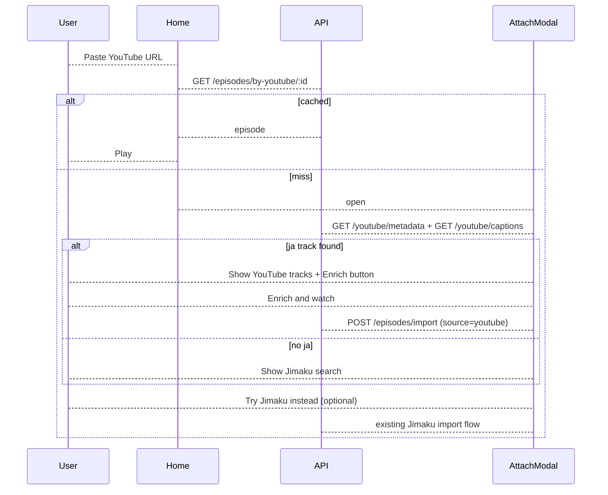

# YouTube-first subtitle attach flow (YTCC)

When a pasted YouTube URL is not in the catalog, probe for Japanese captions via **yt-dlp** first and offer a one-click enrich path; only show the Jimaku picker as a fallback or explicit opt-in.

## Implementation checklist

- [x] Add `packages/api/src/youtube-captions.ts` — yt-dlp list/download + track picker helpers
- [x] Add `GET /api/youtube/captions` and extend `POST /api/episodes/import` for `source=youtube`
- [x] Build `AttachSubtitlesModal` with YouTube-first step and Jimaku fallback step
- [x] Add `fetchYoutubeCaptions` + `startYoutubeImport` to `packages/web/src/lib/api.ts`
- [x] Unit tests for track picker; document yt-dlp requirement in README/BUILD_GUIDE

## Current behavior



Catalog miss in [`packages/web/src/components/Home.tsx`](../packages/web/src/components/Home.tsx) opens [`AttachSubtitlesModal.tsx`](../packages/web/src/components/AttachSubtitlesModal.tsx). The backend uses [`youtube-captions.ts`](../packages/api/src/youtube-captions.ts) (yt-dlp) to list/download tracks; enrichment reuses [`enrichToEpisode`](../packages/api/src/enrich-service.ts) + `stripSrtReadingLines` for learner-channel duplicate kana lines.

## Target behavior

*(Implemented — diagram above.)*

## 1. Backend — YouTube caption module (yt-dlp)

[`packages/api/src/youtube-captions.ts`](../packages/api/src/youtube-captions.ts):

- **`listCaptionTracks(videoId)`** — run `yt-dlp -j --skip-download <url>` (binary from `process.env.YT_DLP_BIN ?? "yt-dlp"`). Parse `subtitles` (manual) and `automatic_captions` (auto) from JSON.
- **`pickBestJaTrack(tracks)`** — prefer manual `ja` / `ja-orig` / `ja-JP`, then auto-generated Japanese. Return `null` if none.
- **`pickBestEnTrack(tracks)`** — same for `en` / `en-US` (optional companion track).
- **`downloadCaptions(videoId, jaLang, enLang?)`** — run:

  ```bash
  yt-dlp --write-subs --sub-langs <langs> --convert-subs srt --skip-download \
    -o /tmp/joylingo-<videoId> <url>
  ```

  Read resulting `.srt` files from a temp dir, delete temp files after read. Reuse existing `stripSrtReadingLines` in enrich-service for ja content.

Export typed errors: `YtDlpNotInstalledError`, `NoJapaneseCaptionsError`, `YoutubeCaptionsError` (video unavailable, rate limit, etc.).

## 2. Backend — API endpoints

[`packages/api/src/server.ts`](../packages/api/src/server.ts):

| Method | Path | Purpose |
|--------|------|---------|
| `GET` | `/api/youtube/captions?videoId=` | List available tracks + `recommended: { ja?, en? }` |
| `POST` | `/api/episodes/import` | Accept **either** Jimaku **or** YouTube source |

Extend `ImportBody`:

```ts
source?: "youtube" | "jimaku"; // default "jimaku" for backward compat
jaLang?: string;   // youtube: e.g. "ja"
enLang?: string;   // youtube: optional
// existing jimaku fields unchanged
```

Import job runner logic:

- **`source: "youtube"`** (or `jaLang` present without `jaFileUrl`): call `downloadCaptions`, build `EnrichRequest` with filenames like `youtube.ja.srt`, pass `title`/`titleEn` from request or YouTube metadata.
- **`source: "jimaku"`** (current): unchanged — download from Jimaku URLs.

No DB schema change required for v1; provenance can stay implicit (`jimaku_entry_id` null = YouTube-sourced).

## 3. Frontend — refactor attach modal

[`AttachSubtitlesModal.tsx`](../packages/web/src/components/AttachSubtitlesModal.tsx) — two internal steps:

**Step `youtube` (default on open):**

- Parallel fetch: `fetchYoutubeMetadata` + `fetchYoutubeCaptions(videoId)`.
- Loading state: "Checking YouTube captions…"
- **If `recommended.ja` exists:** show recommended ja (+ en if available) with labels (creator vs auto-generated). Primary button **"Enrich & watch"** calls `startYoutubeImport({ videoId, jaLang, enLang?, title, titleEn })`.
- Secondary link: **"Search Jimaku instead →"** switches to `jimaku` step.
- **If no Japanese track:** message + prominent button to Jimaku step.

**Step `jimaku`:** existing search → pick entry → pick files → import UI.

Shared enrich progress UI (job polling via existing `getImportJob`) stays the same.

Client helpers in [`packages/web/src/lib/api.ts`](../packages/web/src/lib/api.ts):

- `fetchYoutubeCaptions(videoId)`
- `startYoutubeImport({ youtubeVideoId, jaLang, enLang?, title, titleEn? })`

[`Home.tsx`](../packages/web/src/components/Home.tsx) imports `AttachSubtitlesModal`.

## 4. Track selection UX (recommended defaults)

| Priority | Japanese | English |
|----------|----------|---------|
| 1 | manual `ja` | manual `en` |
| 2 | manual `ja-orig` / `ja-JP` | `en-US` |
| 3 | auto `ja` | auto `en` |

Show user which tier was picked (e.g. "Creator captions" vs "Auto-generated"). Allow changing ja/en dropdown if multiple tracks exist — v1 can ship with recommended-only + Jimaku fallback; dropdown is a small follow-up if multiple manual ja tracks exist.

## 5. Dependencies and docs

- **Runtime requirement:** `yt-dlp` must be on `PATH` (or set `YT_DLP_BIN`). Documented in [`README.md`](../README.md) next to `JIMAKU_API_KEY` setup.
- **No new npm packages** — spawn `child_process.execFile` with timeout (e.g. 30s list, 60s download).
- [`BUILD_GUIDE.md`](BUILD_GUIDE.md) paste-URL flow updated: YouTube captions before Jimaku.

## 6. Tests

- **Unit tests** in `packages/api/test/youtube-captions.test.ts`: `pickBestJaTrack` / `pickBestEnTrack` against sample yt-dlp JSON fixtures (manual morning-routine shape + anime with only auto subs + no ja).
- **Optional integration test** (`YTCC_INTEGRATION=1 npm test`) — list captions for known video `Jh2C7JlWGKU` when yt-dlp + network available.

## Files to touch

| File | Change |
|------|--------|
| `packages/api/src/youtube-captions.ts` | **new** — yt-dlp wrapper |
| `packages/api/src/server.ts` | caption list route + extended import |
| `packages/api/test/youtube-captions.test.ts` | **new** — track picker tests |
| `packages/web/src/lib/api.ts` | caption fetch + youtube import client |
| `packages/web/src/components/AttachSubtitlesModal.tsx` | **new** (evolve from Jimaku modal) |
| `packages/web/src/components/Home.tsx` | use new modal |
| `packages/web/src/immersion-player.css` | minor styles for youtube step |
| `README.md`, `docs/BUILD_GUIDE.md` | yt-dlp prerequisite |

## Out of scope (for later)

- Caching `videoId → caption revision` in DB
- `subtitle_source` column for provenance analytics
- Auto-import without user confirmation (always show what was found)
- Client-side caption fetch (must stay server-side; keys/binary never in browser)
