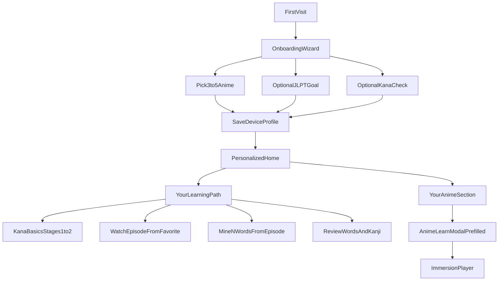

# JoyLingo Revamp — Onboarding, Curriculum, and Learning Methods

Add a device-local onboarding flow where users pick favorite anime and an optional JLPT goal, then surface a hybrid curriculum (kana basics → anime immersion → word/kanji review) on a personalized home feed. Document and incrementally improve the existing learning mechanics for words, kana, and kanji.

## Implementation checklist

- [ ] Add UserProfile type + localStorage/API profile storage (device ID keyed)
- [ ] Build OnboardingWizard: anime multi-select, JLPT goal, optional kana check, App.tsx gate
- [ ] Extract shared AnimeSearchPicker from AnimeLearnModal for onboarding + home
- [ ] Home: Your Anime section + GET /api/episodes?malId= filter + pre-filled AnimeLearnModal
- [ ] Static hybrid curriculum steps + CurriculumPath widget + completion hooks in kana/player/mine
- [ ] Persist mined word deck to localStorage so onboarding progress survives refresh

---

## What JoyLingo uses today (words, kana, kanji)

| Skill | Method today | Algorithm | Persisted where | Gaps |
|-------|----------------|-----------|-----------------|------|
| **Words** | Immersion: tap subtitle → encounter log → manually **mine to deck** → **Review** modal | **No SRS** — binary `learning` / `known` only; all `learning` cards shown every review | Encounters: `localStorage` `joylingo:vocabulary` + best-effort API (`vocabulary_entries`). **Mined deck: in-memory only — lost on refresh** | No spaced repetition; deck not durable |
| **Hiragana / Katakana** | Chart + **romaji quiz** (Kana Pro–style) at [`/learn/kana`](packages/web/src/components/KanaTools.tsx) | **No SRS** — per-character `correct`/`wrong` counters; groups use **stages 1–5** ([`kana.ts`](packages/web/src/lib/kana.ts)) | `localStorage` `joylingo:kana:{script}` | Stats not synced to API |
| **Kanji** | Auto-**derived from tapped words** ([`deriveKanjiProgress`](packages/player-core/src/vocabulary.ts)); review at [`/kanji`](packages/web/src/components/KanjiDashboard.tsx) | **FSRS-lite** (custom): Again resets interval; Good doubles interval (cap 60 days). **Not** full FSRS | `localStorage` `joylingo:kanji-cards` + API mirror (`kanji_cards`) | `seen`/`learning`/`known` status exists but UI mostly uses encounter count + SRS cards |

**Planned upgrade (Phase 5 in [`docs/BUILD_GUIDE.md`](docs/BUILD_GUIDE.md)):** real **FSRS** via `ts-fsrs` for word deck cards with clip links back to anime episodes. Onboarding/curriculum should be built to feed this pipeline, not replace it.

**Identity today:** anonymous **device ID** (`joylingo:device-id`) — no login. **v1 uses device-local MVP**, which matches this.

---

## Target experience (hybrid curriculum)



---

## Phase 1 — Device profile and onboarding gate

### Data model (new shared types in [`packages/shared/src/index.ts`](packages/shared/src/index.ts))

```ts
interface UserProfile {
  onboardingComplete: boolean;
  favoriteAnime: { malId: number; title: string; coverImageURL: string | null }[];
  jlptGoal: "N5" | "N4" | "N3" | "N2" | "N1" | "anime_only" | null;
  preferredStreamMode: "sub" | "dub";
  kanaBaselineDone: boolean;
}
```

### Client persistence ([`packages/web/src/lib/profile.ts`](packages/web/src/lib/profile.ts) — new)

- `localStorage` key: `joylingo:profile`
- Helpers: `loadProfile()`, `saveProfile()`, `addFavoriteAnime()`, `isOnboardingComplete()`

### Optional API mirror ([`packages/api/src/db.ts`](packages/api/src/db.ts))

- New table `user_profiles (user_id TEXT PK, profile JSONB, updated_at)` keyed by existing `x-joylingo-device-id`
- Routes: `GET/PATCH /api/profile` (best-effort sync, same pattern as vocabulary)

### Routing ([`packages/web/src/App.tsx`](packages/web/src/App.tsx))

- New route `/onboarding`
- On app load: if `!profile.onboardingComplete`, redirect `/` → `/onboarding` (skip if user navigates directly to `/watch/...`)

---

## Phase 2 — Onboarding wizard UI

New component: [`packages/web/src/components/OnboardingWizard.tsx`](packages/web/src/components/OnboardingWizard.tsx)

| Step | UI | Reuses |
|------|-----|--------|
| 1 Welcome | Short pitch: learn Japanese from anime you love | — |
| 2 Pick anime | Search + multi-select chips (3–5) | Jikan via existing [`searchAnime`](packages/web/src/lib/api.ts) |
| 3 JLPT goal | Optional: N5–N1 or “Anime only” | — |
| 4 Kana check (optional) | 5 quick prompts OR “Skip — I know kana” | [`KanaQuiz`](packages/web/src/components/KanaQuiz.tsx) subset |
| 5 Done | “Start learning” → save profile → `/` | — |

**Anime picker:** extract search/list UI from [`AnimeLearnModal.tsx`](packages/web/src/components/AnimeLearnModal.tsx) into a shared `AnimeSearchPicker` to avoid duplication (selection only — no Jimaku/import in onboarding).

---

## Phase 3 — Personalized home feed

Update [`packages/web/src/components/Home.tsx`](packages/web/src/components/Home.tsx):

### “Your anime” section

- Render `profile.favoriteAnime` cards (cover, title)
- Actions per show:
  - **Continue** — if catalog has enriched episode for that `malId` (extend [`GET /api/episodes`](packages/api/src/server.ts) with optional `?malId=` filter using existing `episodes.mal_id` column)
  - **Pick episode** — opens `AnimeLearnModal` with `malId` + title pre-filled, starting at episode step

### “Your learning path” widget (curriculum entry point)

- Shows current step, progress bar, CTA button
- Driven by curriculum engine (Phase 4)

---

## Phase 4 — Hybrid curriculum engine

### Curriculum definition ([`packages/shared/src/curriculum.ts`](packages/shared/src/curriculum.ts) — new)

Static steps (v1):

1. **Kana basics** — complete stages 1–2 hiragana quiz with ≥80% on vowels + k/s/t rows OR mark skipped
2. **First immersion** — enrich + watch any episode from a favorite anime (reuse import flow)
3. **Mine words** — mine ≥10 words from that episode (read from `VocabularyMap`)
4. **Review** — complete one word review session + one kanji review session (if cards exist)
5. **Optional JLPT lens** — if `jlptGoal` set, filter kanji dashboard / future word lists by JLPT tag from [`reference.json`](packages/web/public/kanji/reference.json)

### Progress store ([`packages/web/src/lib/curriculum.ts`](packages/web/src/lib/curriculum.ts) — new)

- `localStorage` `joylingo:curriculum-progress`: `{ currentStepId, completedStepIds[], episodeIdForPath? }`
- `getNextStep(profile, progress, vocabulary, kanaStats)` returns step + CTA deep link

### UI

- [`CurriculumPath.tsx`](packages/web/src/components/CurriculumPath.tsx) on Home
- Step completion hooks in existing surfaces:
  - [`KanaTools.tsx`](packages/web/src/components/KanaTools.tsx) — mark kana step on threshold
  - [`ImmersionPlayer.tsx`](packages/web/src/components/ImmersionPlayer.tsx) — mark immersion step on first watch
  - [`DictionaryCard.tsx`](packages/web/src/components/DictionaryCard.tsx) — count mines toward mine step

---

## Phase 5 — Foundations to make learning stick (recommended in same milestone)

These are small but critical so onboarding/curriculum isn’t undermined:

1. **Persist word deck to localStorage** ([`ImmersionPlayer.tsx`](packages/web/src/components/ImmersionPlayer.tsx) + [`deck.ts`](packages/player-core/src/deck.ts)) — today `KnowledgeMap` is lost on refresh
2. **Load vocabulary + deck from localStorage on boot** (already partial for vocabulary)
3. **Optional:** tag mined words with `malId` / `episodeId` when mining from anime episodes so “words from your anime” view is possible later

Full FSRS (Phase 5 roadmap) can follow as a separate PR using `ts-fsrs` once deck persistence exists.

---

## API additions (minimal)

| Endpoint | Purpose |
|----------|---------|
| `GET/PATCH /api/profile` | Mirror device profile JSON |
| `GET /api/episodes?malId=21` | List enriched episodes for a favorite show |
| (existing) `GET /api/anime/search` | Onboarding anime picker |

---

## Out of scope for v1 (defer)

- User accounts / login (Phase 4 BUILD_GUIDE)
- Full FSRS for words (Phase 5)
- Bulk pre-enrichment of entire anime series
- Admin curriculum editor UI (use static JSON first)

---

## Success criteria

- New user completes onboarding, picks One Piece + 2 other anime, lands on personalized Home
- Home shows “Your anime” with One Piece and a path to watch/learn
- Curriculum widget advances: kana → first episode → mine 10 words → review
- User can answer: words = immersion + manual mining; kana = recognition quiz; kanji = derived from words + interval SRS-lite
